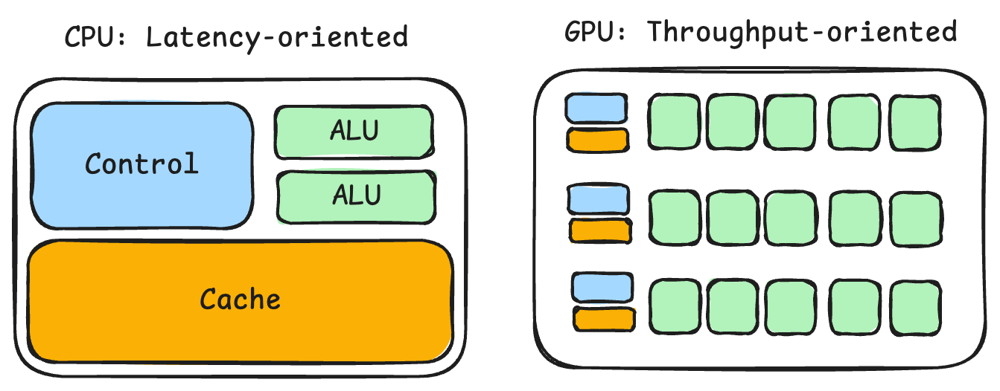

# Intro to CPU and GPU

## Components

### Control Unit (CU)

The CU coordinates CPU operations.
* Fetches instructions from memory
* Decodes what each instruction means
* Sends control signals to the ALU, registers, memory, and other components
* Decides the order in which operations happen

### Arithmetic Logic Unit (ALU)

The ALU performs calculations and logical operations.

* Arithmetic: +, -, multiplication-related steps
* Logic: AND, OR, XOR, NOT
* Comparisons: <, >, ==
* Bit shifting

### Cache

Cache is very fast memory located inside or close to the CPU.

It stores recently or frequently used:
* Instructions
* Data

## Difference

| | CPU | GPU |
| :---: | :---: | :---: |
| **CU**        | Large and sophisticated   | Smaller per compute group                         |
| **ALU** | Relatively few, powerful  | Very many, simpler                                |
| **Cache**                | Large, low-latency        | Smaller per thread/core, optimized for throughput |
| **Goal**            | Finish one thread quickly | Process many similar tasks simultaneously         |
| **Use Case** | For ***sequential*** parts that latency hurts | For ***parallel*** parts that throughput wins |
