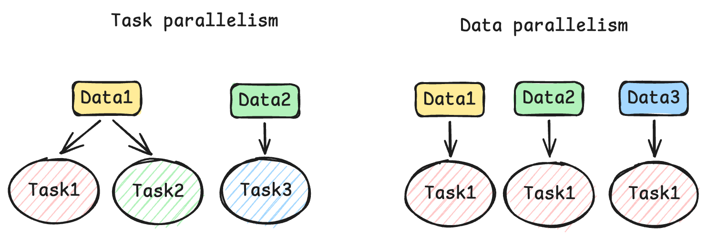
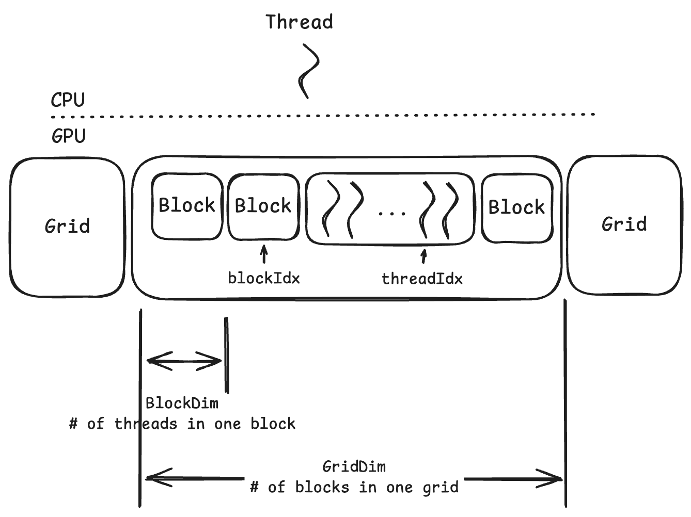
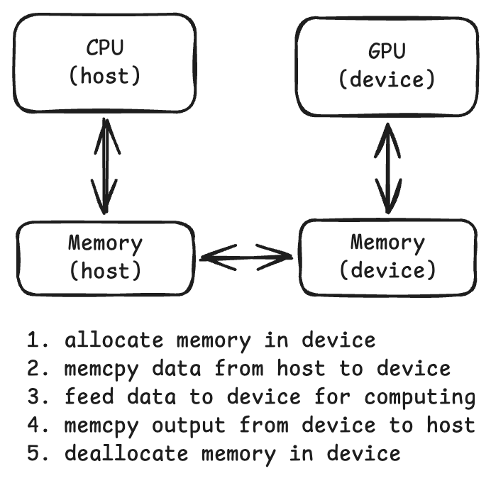
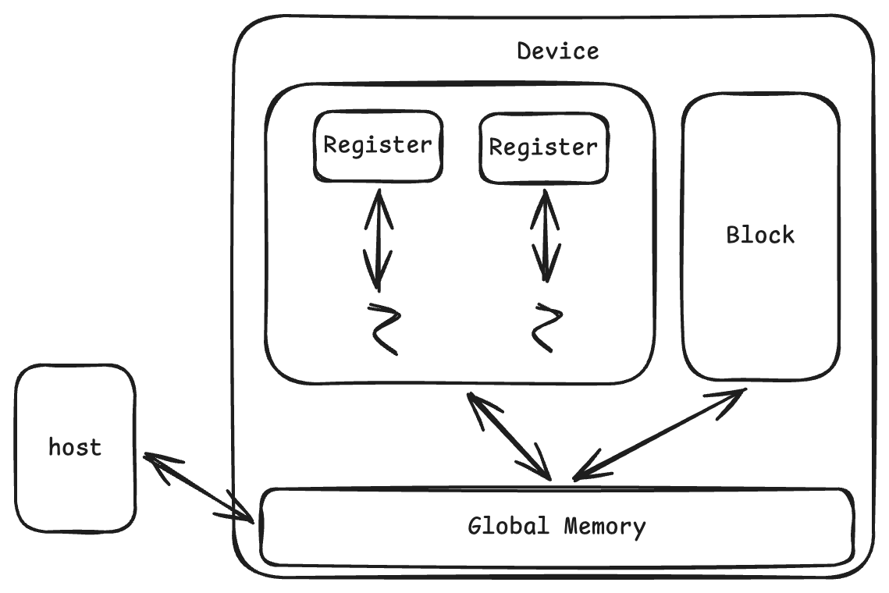

# Type of Parallelism



---

# Thread Block Arch

A CUDA kernel is executed as a grid of threads. All threads in one grid run the same kernel code. Each thread has a **unique index** that it uses to compute memory address.

> This is called SIMD (Single Instruction Multiple Data)



Threads within a block:
* Shared memory
* Atomic operations
* Barrier sync

Threads in different blocks:
* Cooperate less

For every single thread, you can calculate the unique index by
```c++
size_t i = blockDim * blockIdx + threadIdx;
```

---

# Memory Management between CPU and GPU





* Device can
    * R/W every thread's own register
    * R/W shared global memory
* Host can transfer data from/to device's memory

```c
cudaError_t cudaMalloc(void **devicePtr, size_t size);

cudaError_t cudaFree(void *devicePtr);

// type of transfer:
//  * cudaMemcpyHostToHost
//  * cudaMemcpyHostToDevice
//  * cudaMemcpyDeviceToHost
//  * cudaMemcpyDeviceToDevice
cudaError_t cudaMemcpy(void *dst, const void *src, size_t count, enum cudaMemcpyKind kind);
```

---

# Kernel

The business logic running in grid is called kernel code. A grid can be launched by calling a kernel and configuring it with grid and block size.

```c
// vector add => c = a + b
__global__
void vecAddKernel(float *A, float *B, float *C, size_t n) {
    // these are some special var name
    // their values are depends one the given `numBlocks` and `numThreadsPerBlock`
    size_t i = blockIdx.x * blockDim.x + threadIdx.x;

    // ⚠️ boundary check
    if (i < n) { 
        C[i] = A[i] + B[i];
    }
};

int main() {
    // n is total amount of threads we need
    const unsigned int numThreadsPerBlock = ...;
    const unsigned int numBlocks = ceil(1.0 * n / numThreadsPerBlock);
    dim3 DimGrid(numBlocks, 1, 1);
    dim3 DimBlock(numThreadsPerBlock, 1, 1);
    vecAddKernel<<<DimGrid, DimBlock>>>(...);

    return 0;
}
```

> [!IMPORTANT]
> Always remember to check boundary! Because we use `ceil`, which means sometimes we allocate more threads in the last block than real needs.

> [!NOTE]
> CUDA supports multi-dimensional grids/blocks (up to 3), for example, `dim3 DimGrid(x, y, z)` represents grid's dimensions.

> [!NOTE]
> `blockIdx`, `blockDim`, `threadIdx` and `gridDim` are four build-in keywords in CUDA. They all have 3 dimensions (`x`, `y` and `z`).

| Keyword | Callable from | Executable on |
| :---: | :---: | :---: |
| `__host__`(default) | Host | Host |
| `__device__` | Device | Device |
| `__global__` | Host / Device | Device |

> [!IMPORTANT]
> * kernel function (`__global__`) must return `void`.
> * `__host__ __device__` can be used together to define helper functions that callable from either device or host.

---

# Async

Kernel calls are async, it won't block CPU computation. If you want to wait for the kernel, use `cudaError_t cudaDeviceSynchronize()` after the kernel call.

There are more ways to better support timing execution, please check following notes.
