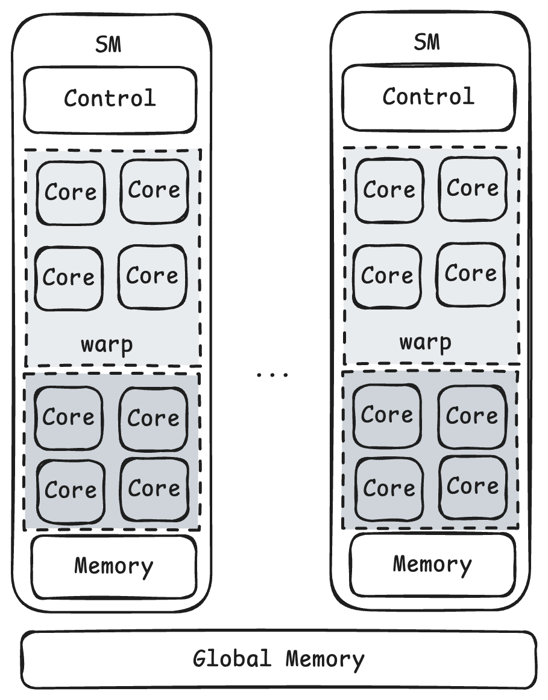
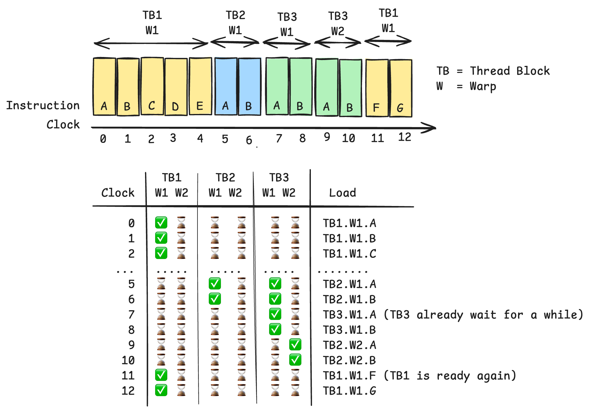
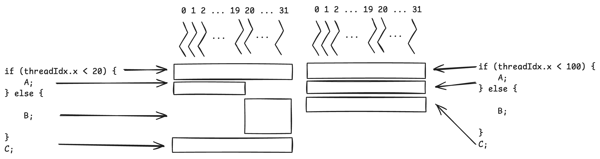

# Streaming Multiprocessor (SM)



The SM is a physical component of the GPU, while the grid is a logical unit of CUDA execution.
* **CUDA logical hierarchy**: Grid &rarr; Block &rarr; Thread
    * These are logical abstractions exposed to CUDA programmers.
* **GPU execution hierarchy**: GPU &rarr; SM &rarr; Warp &rarr; Thread
    * These represent the hardware and execution groups that process the workload.

## Grid / Block / SM / Warp

* Grid &rarr; represents the entire workload of a single kernel launch.
    * A grid contains many blocks.
    * A grid does not map to a single SM.
    * A grid may contain thousands of blocks, while the GPU may have only tens or hundreds of SMs.
* Block &rarr; is the main scheduling unit assigned to an SM.
    * Once a block starts running on an SM, the entire block stays on that SM.
    * Threads from the same block are not split across multiple SMs.
* SM &rarr; is the physical hardware unit that executes blocks.
    * One SM can execute multiple blocks:
        * sequentially, as previous blocks finish
        * concurrently, if registers, shared memory, warp slots, and other resources are available.
* Warp &rarr; is a group of 32 threads that the SM schedules and executes together
    * A block is divided into warps in groups of 32 consecutive threads
    * A warp executes one instruction for its active threads at a time, following the SIMD (Single Instruction Multiple Data) model

## Example

Let's say we have one grid with 100 thread blocks, from `block0` to `block99`. The entire grid runs the same logic or kernel—for example, adding the elements of two vectors.

The GPU may have only 10 SMs. It may use a schedule such as:
```
SM0 => Block0, Block10, Block20, ...
SM1 => Block1, Block11, Block21, ...
...
SM9 => Block9, Block19, Block29, ...
```

The actual schedule may differ depending on resource availability and the order in which blocks become ready to run.

Every block is assigned to one SM according to resource availability. If no SM is available, the block waits in a queue.

For a block with 128 threads, the SM divides the threads into four warps, `warp0` through `warp3`. Each warp contains 32 threads. The SM schedules these warps and executes their instructions according to the SIMT model.

```
SM_x.Block_y
warp0: thread0 ~ thread31
warp1: thread32 ~ thread63
warp2: thread64 ~ thread95
warp3: thread96 ~ thread127
```

---

# Synchronization Within a Thread Block

Threads in the same block can collaborate in ways that threads in different blocks cannot:
* Lightweight barrier sync
    * `__syncthreads()` &rarr; waits for all threads in the block to reach the barrier before any thread can proceed
* Shared memory
    * provides fast memory that can be accessed by threads in the same block

By default, threads are not synchronized across different blocks. However,
there are ways to synchronize threads across blocks:

* **Cooperative Groups** &rarr; allows barrier synchronization across clusters of thread blocks, or across the entire grid by limiting the number of blocks so that all blocks can execute simultaneously without causing a deadlock.
* **Unidirectional synchronization** &rarr; ensures that the producer block is scheduled before the consumer block.

---

# Scheduling

SM implements zero-overhead warp scheduling:
* warps whose next instruction has its operands ready for consumption are eligible for execution
* eligible warps are selected for execution on a prioritized scheduling policy
* all threads in a warp execute the same instruction when selected



Warp stall &rarr; schedule another ready warp &rarr; stalled warp becomes ready &rarr; eligible for scheduling again

## Latency Hiding

If the running warp needs a long-latency operation, the SM may switch to other ready warp to reduce the idle time.

**Occupancy** refers to the ratio of the active threads to the maximum allowed. In general, the maximum occupancy is desirable because it improves latency hiding.

---

# SIMD

* ✅ share the same instruction fetch/dispatch unit across multiple execution units
* ❌ control divergence &rarr; different threads taking different execution paths

> [!NOTE]
> For example, if the instruction has `if-else` clause. One warp may has 20 of 32 threads execute `if` while 12 of 32 threads execute `else` clause.
> 
> The percentage of threads enabled during SIMD called **SIMD efficiency**.

A good way to avoid divergence is: try to make branch granularity a multiple of warp size `if (threadIdx.x / wrapSize > 2); else;`
