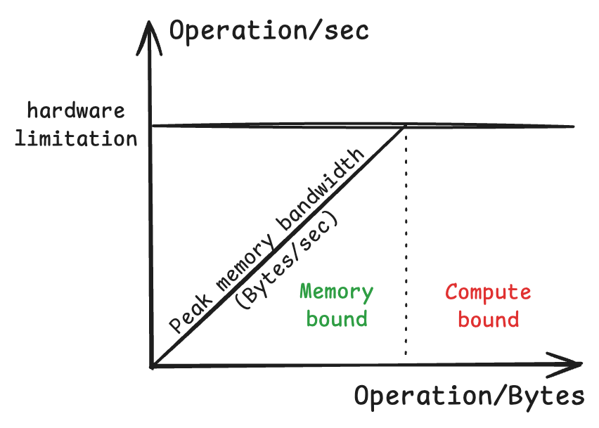

# Memory in CUDA Architecture

Every thread can:
* R/W **register** (cycle)
* R/W block **shared memory** (tens cycles)
* R/W grid **global memory** (hundreds cycles)
* Read grid **constant memory** (cycle)

| | Global Memory | Shared Memory | Constant Memory |
| :---: | :---: | :---: | :---: |
| Where | GPU | SM | GPU special read-only |
| Range | Grid (all threads) | Block | Grid (all threads) |
| Kernel Read | ✅ | ✅ | ✅ |
| Kernel Write | ✅ | ✅ | ❌ |
| Host Read/Write | ✅ | ❌ | ✅ |
| Size | ~GB | ~KB | 64KB | 
| Speed | hundreds cycles | tens cycles | cycles w "cache hit + broadcast"* |
| Keyword | `cudaMalloc` | `__shared__` | `__constant__` |

> [*] For example, if multiple threads in a warp need to access same data, the constant memory will load it into cache and broadcast to all threads.

---

# CUDA type

| Variable declaration | Memory | Scope | Lifetime |
| :---: | :---: | :---: | :---: |
| `__device__ int globalVar;` | global | grid | application |
| `__device__ __shared__ int sharedVar;` | shared | block | block |
| `__device__ __constant__ int constVar;` | constant | grid | application |
| `int localVal` | register | thread | thread |
| `int localArr[N];` | global | thread | thread |

---

# Performance Metric

Here are two most common metrics to measure performance:
* FLOPS &rarr; floating point operations per second
* Memory Bandwidth &rarr; bytes per second

A kernel can be:
* Compute-bound &rarr; performance limited by FLOPS
    * The processor's cores are fully utilized
* Memory-bound &rarr; performance limited by memory bandwidth
    * The processor's cores are frequently idle and wait for data from memory

The **roofline model** helps visualize a kernel's performance bound based on the ratio of operations it performs and bytes it accesses from memory.

