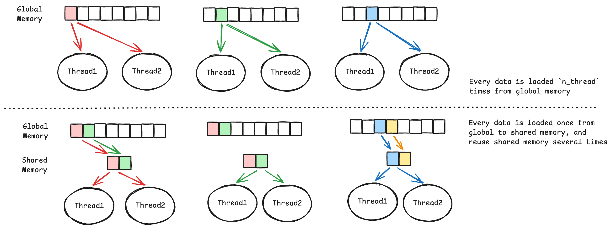
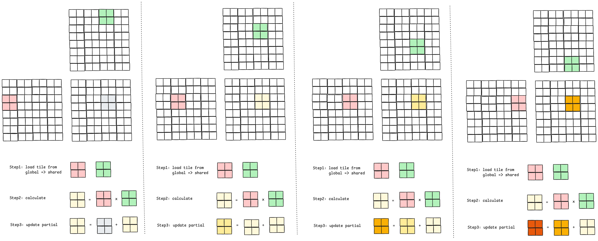

# Data Locality and Tile

Please check [MP2](../projects/MP2/), it requires an implementation to support matrix multiply.

## Simple but bad

The simplest but bad performance implementation is:
```c++
__global__
void matMulKernel(float *input1, float *input2, float *output, size_t N) {
    size_t row = blockIdx.y * blockDim.y + threadIdx.y;
    size_t col = blockIdx.x * blockDim.x + threadIdx.x;
    float sum = 0.0;
    for (size_t k = 0; k < N; ++k) {
        float a = input1[row * N + k];
        float b = input2[k * N + col];
        sum += a * b;
    }
    output[row * N + col] = sum;
}
```
This code needs to get data from global memory all the time during the computing.

## Smart :)

To avoid the global memory bottleneck, tile the input data to take advantage of shared memory:
* partition data into subsets(tiles) that fit into shared memory
* handle each data subset with one thread block by
    * loading the subset from global memory to shared memory, using multiple threads to exploit memory-level parallelism
    * performing the computation on the subset from shared memory
    * copying results from register to global memory





> [!NOTE]
> For example, it our hardware has: 1000 GFLOP/s and 150 GB/s. The multiple requires 4 B/FLOP (load 2 floats for calculation).
> * If we don't use tile, the 150 GB/s supports only `150 / 4 = 37.5 GFLOP/s`.
> * If we use `16 x 16` tile, the 150 GB/s supoorts `150 / 4 x 16 = 600 GFLOP/s`.
> * If we use `32 x 32` tile, the 150 GB/s supports `150 / 4 x 32 = 1200 GFLOP/s`, and already reach the 1000 GFLOP/s limit.

### Sync Issue

The figure shows how we effectively compute matrix mulitple by utilizing data locality and tile. However, it still has one hide issue: synchronization &rarr; before we get next tile, we need make sure the previous calculation is finished and the tile in shared memory can be replaced.

> `__syncthreads()` works as a barrier &rarr; all threads in the same block must reach this point before start next step.

### Dynamic shared memory

Shared memory can be dynamically allocated.
```cpp
extern __shared__ A_s[];
...
kernel<<<numBlocks, numThreadsPerBlock, smemPerBlock>>>(...);
```
