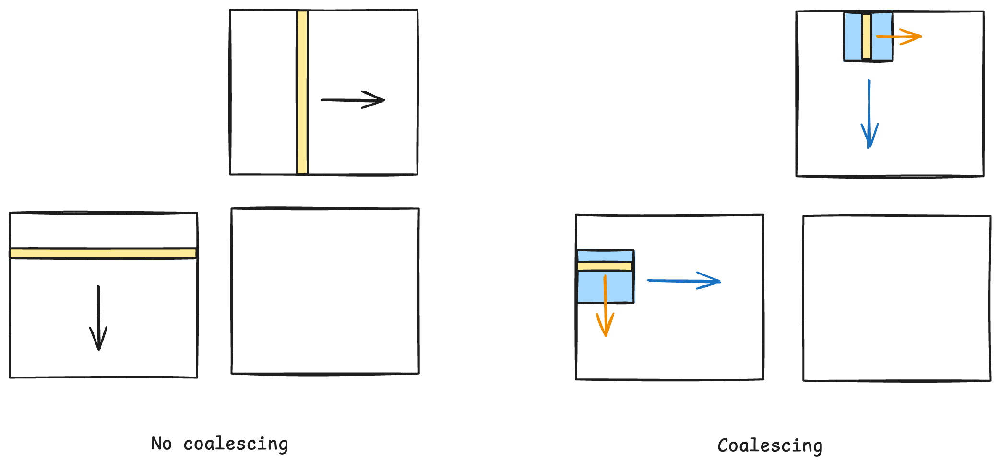

# DRAM (Dynamic Random Access Memory)

The capacitor gradually loses charge, so DRAM must be periodically refreshed to preserve data. This is why it is called **dynamic** RAM.

```
             Columns
          0   1   2   3   ...
       ┌───┬───┬───┬───┐
Row 0  │   │   │   │   │
       ├───┼───┼───┼───┤
Row 1  │   │   │ X │   │
       ├───┼───┼───┼───┤
Row 2  │   │   │   │   │
       └───┴───┴───┴───┘
```

To access `X`, DRAM does not directly read that individual cell.

DRAM first activates an entire row and copies it into a row buffer, which is implemented using sense amplifiers. After the row is open, column accesses select data from the row buffer.
* If the data is already in the row buffer &rarr; read from the buffer.
* If the data is in a different row &rarr; close the current row, activate the new row, place it in the row buffer, and then select the requested data.

```
Access data in different bursts
[------burst------][X][------burst------][X]

Access data in same burst
[------burst------][X][X]
```

---

# DRAM Access as a Pipeline

A DRAM request passes through several stages. A simplified sequence is:

```text
request address
      ↓
decode the bank and row
      ↓
activate the row
      ↓
select the column
      ↓
transfer a burst of data
```

This is similar to a CPU instruction pipeline. In a CPU pipeline, one instruction may be executing while another instruction is being decoded.

In DRAM, one request may be transferring data while another request is being prepared in a different stage. The stages can overlap, so the memory system can start processing new requests before earlier requests have completely finished.

Multiple DRAM banks provide parallel pipelines. For example, while bank 0 is processing one request, bank 1 may activate a row and bank 2 may transfer a
burst:

```text
             request 1       request 2       request 3
Bank 0:      [activate] ----> [column] -----> [burst]
Bank 1:      [column] ------> [burst] ------> [activate]
Bank 2:      [burst] -------> [activate] ---> [column]
```

This overlap is the main reason that multiple banks can improve throughput.

```text
Don't utilize pipeline
[----burst----][x][x][x][----burst----][x][x][x][----burst----][x][x][x]

Utilize pipeline
[----burst----][x][x][x]
[---------burst---------][x][x][x]
[--------------burst--------------][x][x][x]
```

---

# Memory Coalescing

When threads in the same warp access consecutive memory locations in the same burst, the accesses can be combined and served by one burst.



---

# Thread Coarsening

Thread coarsening assigns multiple pieces of work to each thread instead of assigning one piece of work to each thread. This reduces the total number of threads and can reduce thread-management, scheduling, and memory-access overhead.

```text
Without coarsening:  thread0 -> output0
                     thread1 -> output1
                     thread2 -> output2
                     thread3 -> output3

Coarsening factor = 2:
                     thread0 -> output0, output1
                     thread1 -> output2, output3
```

Thread coarsening can improve performance by:

* reducing the number of threads, warps, and scheduling operations
* reusing values kept in registers or cache
* reducing the overhead of repeated instructions and memory operations

However, excessive coarsening can hurt performance.
* Each thread uses more registers and performs more sequential work, which can reduce occupancy and limit the number of warps available for latency hiding
* Reduce parallelism and make load balancing worse if different outputs require different amounts of work

---

# Loop Unrolling & Instruction Scheduling

Loop unrolling transforms a loop by replicating the body of the loop by some factor and reducing the number of loop.
* Fewer loop implies fewer branches (branch has long-latency in the absence of branch predication)
* Exposes more independent instructions for scheduling

```cpp
for (size_t i = 0; i < 8; ++i) {
      foo(i);
}

for (size_t i = 0; i < 8; i += 2) {
      foo(i);
      foo(i+1);
}
```

Reorder instructions to make it more efficient.

```cpp
foo(i);
bar(i);
foo(i+1);
bar(i+1);

foo(i);
foo(i+1);
bar(i);
bar(i+1);
```

---

# Double Buffering

Double buffering uses two buffers so that data loading and computation can overlap.

Without double buffering:
```
load -> wait -> compute -> load -> wait -> compute
```
With double buffering:
```
load A
compute A || load B
compute B || load A
```
The main goal is to hide memory latency by overlapping data movement with computation.

In CUDA, double buffering is commonly used with shared memory tiling: while the GPU computes on one tile in shared memory, it loads the next tile from global memory into another shared memory buffer.

```cpp
for (size_t i = 0; i < N; ++i) {
      ... = buffer[anotherThreadId];
      __syncthreads();
      buffer[currentThreadId] = ...;
      __syncthreads();
}

for (size_t = i; i < N; ++i) {
      ... = inbuffer[anotherThreadId];
      outbuffer[currentThreadId] = ...;
      __syncthreads();
      swap(inbuffer, outbuffer);
}
```
