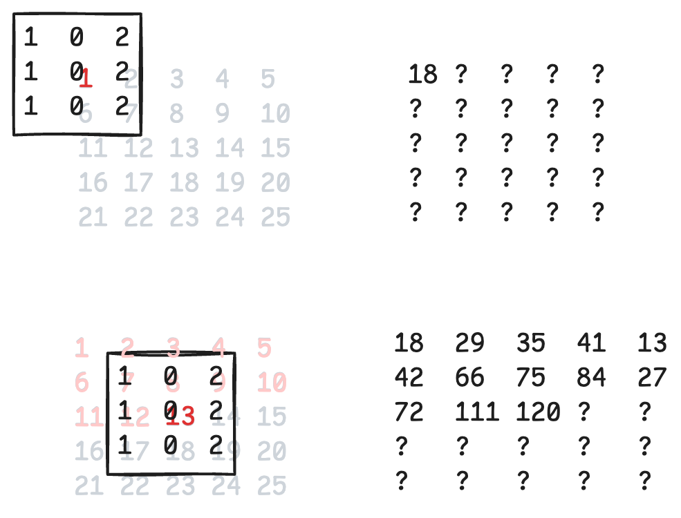
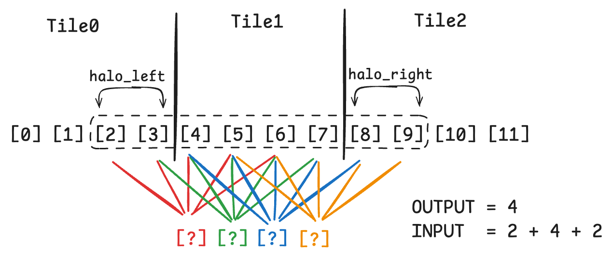
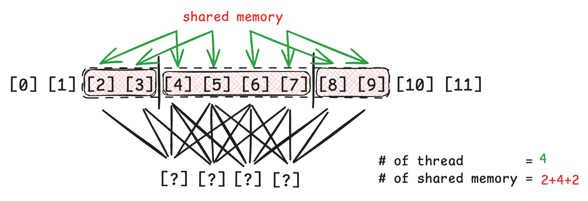
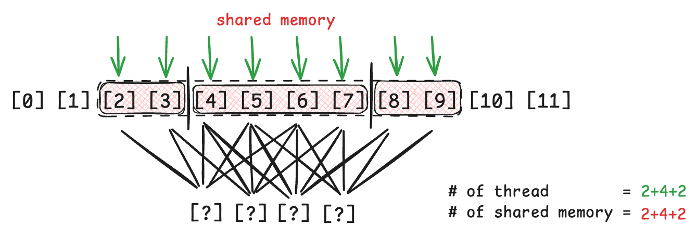

# Convolution vs Cross-Correlation

| | Convolution | Cross-Correlation |
| :---: | :---: | :---: |
| Continuous | $$(f * g)(x) = \int_{-\infty}^{\infty} f(\tau)\, g(x-\tau)\, d\tau$$ | $$(f \star g)(x) = \int_{-\infty}^{\infty} f(\tau)\, g(\tau + x)\, d\tau$$ |
| Discrete | $$(f * g)[x] = \sum_{k=-\infty}^{\infty} f[k]\, g[x-k]$$ | $$(f \star g)[x] = \sum_{k=-\infty}^{\infty} f[k]\, g[k+x]$$ |
| Filp | Flip one input, then slide and multiply | Slide directly, without flipping |
| Use case | Classical signal processing because it naturally describes the output of a linear time-invariant system | Measure similarity/alignment |

The key difference is **whether the filter/kernel is flipped**.

> [!NOTE]
> Actually, Convolutional Neural Network (CNN) uses cross-correlation rather than convolution, even though the operation is called convolution.


Cross-correlation slides a small **mask** over the input and computes a weighted sum at each position.

For a 2D input:

$$
y[i,j] = \sum_m \sum_n x[i+m, j+n]\,mask[m,n]
$$

Example:

$$
x =
\begin{bmatrix}
1 & 2 & 3 & 4 & 5 \\
6 & 7 & 8 & 9 & 10 \\
11 & 12 & 13 & 14 & 15 \\
16 & 17 & 18 & 19 & 20 \\
21 & 22 & 23 & 24 & 25 \\
\end{bmatrix}
, \
mask =
\begin{bmatrix}
1 & 0 & 2 \\
1 & 0 & 2 \\
1 & 0 & 2
\end{bmatrix}
$$

At each location:
1. Place the mask on top of a small image region
2. Multiply corresponding elements
3. Sum all the products
4. Move the mask to the next position



---

# Constant Cache

> [!IMPORTANT]
> The difference between "Shared memory" with "Cache" are:
> * shared memory is controlled by programmer, while cache is controlled by computer architecture
> * shared memory requires explicit data transfer instruction, while cache stores copy of data

Constant cache is a special cache for constant data that will not be modified during kernel execution by a grid, so it can be accessed with higher throughput for common pattern.

When use constant cache in CUDA, it can only be initialized in host, and up to 64 KB.

```cpp
// global var
__constant__ float filter_c[FILTER_DIM];

// inside host function
cudaMemcpyToSymbol(filter_c, filter, FILTER_DIM * sizeof(float), offset = 0, kind = cudaMemcpyHostToDevice);
```

---

# Example: 1D CNN

## Basic

```cpp
__global__
void convolution_1D_basic_kernel(float *input, float *mask, float *output, int mask_width, int width) {
    int i = blockIdx.x * blockDim.x + threadIdx.x;
    
    float value = 0.0;
    int start = i - (mask_width / 2);

    for (int j = 0; j < mask_width; ++j) {
        int pos = start + j;
        if (pos >= 0 && pos < width) {
            value += input[pos] * mask[j]; // ⚠️ it loads constant mask from global memory
        }
    }

    output[i] = value;
}

void host_function() {
    ...
    float mask[MASK_WIDTH] = {...};
    convolution_1D_basic_kernel<<<gridDim, blockDim>>>(input, mask, output, MASK_WIDTH, WIDTH);
}
```

This implementation needs to load both mask and input from global memory.

## With Constant Cache

```cpp
__constant__ float constant_mask[MASK_WIDTH];

// ⚠️ no need to pass mask as parameter
__global__
void convolution_1D_const_cache_kernel(float *input, float *output, int mask_width, int width) {
    int i = blockIdx.x * blockDim.x + threadIdx.x;
    
    float value = 0.0;
    int start = i - (mask_width / 2);

    for (int j = 0; j < mask_width; ++j) {
        int pos = start + j;
        if (pos >= 0 && pos < width) {
            value += input[pos] * constant_mask[j]; // ⚠️ directly read from constant cache
        }
    }

    output[i] = value;
}

void host_function() {
    ...
    float mask[MASK_WIDTH] = {...};
    cudaMemcpyToSymbol(constant_mask, mask, MASK_WIDTH * sizeof(float));
    convolution_1D_const_cache_kernel<<<gridDim, blockDim>>>(input, output, MASK_WIDTH, WIDTH);
}
```

By using constant cache, it reduces the load for mask. However, the input is still loaded several times from global memory.

## Constant Cache + Shared Memory Tile

Besides reusing mask, the input can also be reused by shared memory tiling.

Assume the `MASK_WIDTH = 5`, then the input should contains two more elements on both front and tail sides (called halo, in this case, the `halo_radius = 2`). The amount of elements it need is greater than the size of output, here are three approaches.



### Approach 1 - Shared-memory tile only contains the output-sized region

During convolution, if the needed element is inside the shared tile, read shared memory; if it's in the halo, read it directly from global memory.

**Advantages**
- Simple one-element-per-thread loading.
- All threads participate in computation.
- Requires less shared memory.
- No explicit halo loading.

**Disadvantages**
- Halo elements are fetched from global memory.
- Causes redundant global-memory accesses between neighboring blocks.
- Higher memory traffic than caching the full input tile.
- More complicated access logic during convolution.


```cpp
// Step 1: load current tile into shared memory
int index = blockIdx.x * blockDim.x + threadIdx.x;

__shared__ float input_sharedmem[TILE_WIDTH];

if (index < WIDTH) {
    input_sharedmem[threadIdx.x] = input[index];
}
__syncthreads();

// Step 2: compute convolution
if (index < WIDTH) {
    int r = MASK_WIDTH / 2;
    int cur_tile_start = blockIdx.x * blockDim.x;
    int next_tile_start = cur_tile_start + blockDim.x;
    int input_start = index - r;
    float value = 0.0f;

    for (int j = 0; j < MASK_WIDTH; ++j) {
        int input_index = input_start + j;
        if (input_index >= 0 && input_index < WIDTH) {
            // if (inside current tile) -> shared memory
            // else                     -> global memory
            if (input_index >= cur_tile_start && input_index < next_tile_start) {
                int shared_index = input_index - cur_tile_start;
                value += input_sharedmem[shared_index] * mask[j];
            } else {
                value += input[input_index] * mask[j];
            }
        }
    }

    output[index] = value;
}
```


### Approach 2 - Output-sized block, but threads cooperatively load the halos too

There are only 4 threads but 8 values to load, so each thread may load more than one value.

**Advantage**
* All halo data is cached in shared memory before computation.
* All threads participate in output computation.
* No halo reads from global memory during the convolution loop.

**Disadvantage**
* Loading logic is more complicated.
* Each thread may need to perform multiple global-memory loads.
* Need careful boundary handling for the first/last blocks.



```cpp
// Step 1 - load internal + halo
int index = blockIdx.x * blockDim.x + threadIdx.x;
int r = MASK_WIDTH / 2;

__shared__ float input_sharedmem[TILE_WIDTH + MASK_WIDTH - 1];

int input_tile_start = blockIdx.x * blockDim.x - r;
int input_tile_size = TILE_WIDTH + MASK_WIDTH - 1;

// Each thread may load more than one element
for (int shared_index = threadIdx.x; shared_index < input_tile_size; shared_index += blockDim.x) {
    int input_index = input_tile_start + shared_index;
    if (input_index >= 0 && input_index < WIDTH) {
        input_sharedmem[shared_index] = input[input_index];
    } else {
        input_sharedmem[shared_index] = 0.0f;
    }
}

__syncthreads();

// Step 2 - compute
if (index < WIDTH) {
    float value = 0.0f;
    for (int j = 0; j < MASK_WIDTH; ++j) {
        value += input_sharedmem[threadIdx.x + j] * mask[j];
    }
    output[index] = value;
}
```

### Approach 3 - Input-sized block, one load per thread

Launch enough threads for the entire input tile, including halos. Every thread loads exactly one input element into shared memory.

Only the threads corresponding to the valid output region perform convolution. Halo threads remain idle during computation.

**Advantage**
- Very simple shared-memory loading.
- Exactly one global-memory load per thread.
- Halo data is fully cached in shared memory.

**Disadvantage**
- Some threads only load data and do no output computation.
- Wastes thread resources during the compute phase.
- For a large mask, the fraction of idle threads can become significant.
- More threads per block can limit occupancy/resources.



```cpp
// Step 1 - each thread loads one input element
int r = MASK_WIDTH / 2;
int input_tile_start = blockIdx.x * OUTPUT_TILE_SIZE - r;
int input_index = input_tile_start + threadIdx.x;

__shared__ float input_sharedmem[INPUT_TILE_SIZE];

if (input_index >= 0 && input_index < WIDTH) {
    input_sharedmem[threadIdx.x] = input[input_index];
} else {
    input_sharedmem[threadIdx.x] = 0.0f;
}

__syncthreads();

// Step 2 - only output threads compute
if (threadIdx.x >= r && threadIdx.x < r + OUTPUT_TILE_SIZE) {
    int output_index = blockIdx.x * OUTPUT_TILE_SIZE + (threadIdx.x - r);

    if (output_index < WIDTH) {
        float value = 0.0f;
        int shared_start = threadIdx.x - r;

        for (int j = 0; j < MASK_WIDTH; ++j) {
            value += input_sharedmem[shared_start + j] * mask[j];
        }
        output[output_index] = value;
    }
}
```
